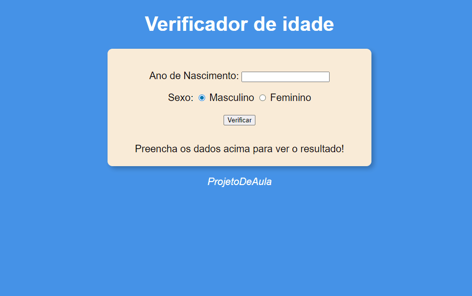

<h1 align="center">Verificador de Idade</h1>

Este pequeno projeto foi feito para calcular a idade do usuário com base na data de nascimento do próprio, ou das pessoas alheias.

## Índice

- [Visão Geral](#visão-geral)
- [Funcionalidades](#funcionalidades)
- [Demo](#demo)
- [Contato](#contato)

## Visão Geral

O site foi construído de uma forma que fosse bastante prático e intuitivo de se usar, colocando seu ano de nascimento no input, ele te dá a data do seu nascimento e uma ilustração visual de como é as pessoas nessa idade, dando uma forma mais visual e interessante.

## Funcionalidades

- Mostra a idade do usuário ao colocar seu ano de nascimento;
- Há uma ilustração de como a pessoa é nessa faixa etária de idade;
- O verificador de idade calcula sua idade com base no ano atual e o ano de nascimento, fazendo uma subtração e te dando o resultado e uma forma visual;

## Demo

[Link para a demonstração do projeto](https://bruno-nog.github.io/verificador-de-idade/)

## Contato

